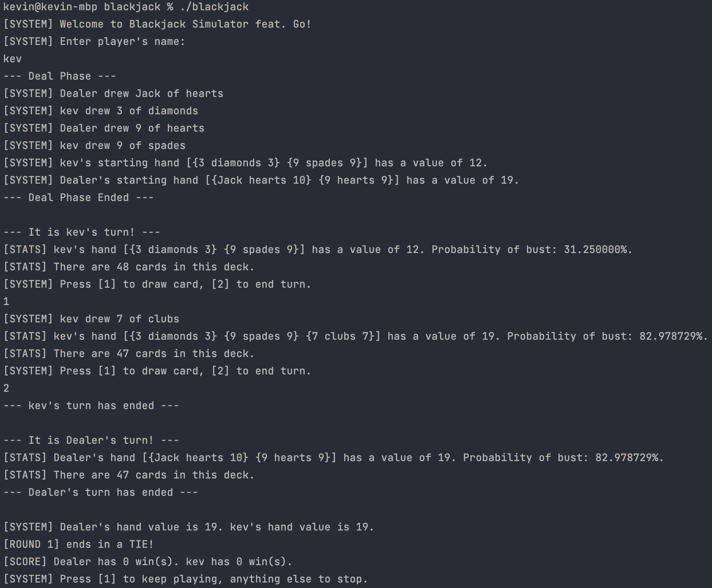

# Blackjack Game
Creating a Blackjack CLI game as my first Golang project to learn this language.

## Installation
### MacOS

1. Download the archive for your operating system and architecture i.e. `blackjack_1.1.0_Darwin_arm64.tar.gz`
2. In your terminal, navigate to where the blackjack folder is downloaded `cd ~/path/to/blackjack_1.1.0_Darwin_arm64`
3. Decompress the archive `tar -xvf blackjack_1.1.0_Darwin_arm64.tar.gz`
4. Go into the folder `cd blackjack_1.1.0_Darwin_arm64`
5. Allow the `blackjack` binary to execute `chmod u+x ./blackjack`
7. Type `./blackjack` in your terminal to execute. You may need to adjust your Mac settings to trust

### Windows
1. Download the executable `blackjack.exe`
2. Execute it to run

Progress thus far:  

